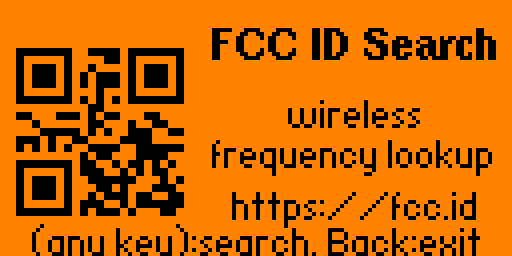
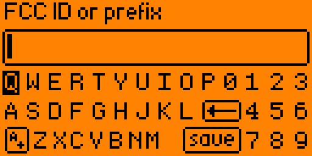
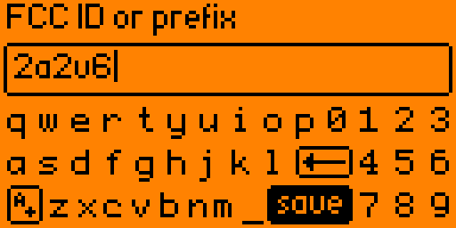
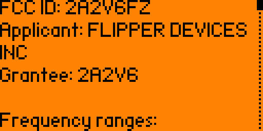
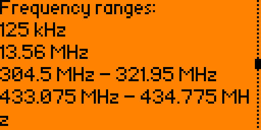

# FCC ID Lookup for Flipper Zero

Offline FCC ID search for Flipper Zero.

The app lets you enter a full FCC ID or prefix, browse matching FCC IDs, and view:

- FCC ID
- Grantee/applicant
- Frequency range or ranges
- Data attribution

Data is sourced from <https://fccid.io>.

## Screenshots







## Files

- `application.fam` - uFBT external app manifest
- `fcc_id_lookup.c` - Flipper app source
- `fcc_qr_code.h` - startup QR bitmap
- `fcc_id_lookup_icon.png` - 10x10 1-bit app icon
- `fcc_freq_v2.bin` - compact FCC ID database
- `deploy_to_flipper.sh` - build, upload database, install, and launch

## Deploy

Connect one Flipper over USB, then run:

```sh
./deploy_to_flipper.sh
```

By default the deploy script uses uFBT/storage auto-detection, so it works with
whichever connected Flipper is visible to the tools. If more than one Flipper is
connected, or auto-detection chooses the wrong device, pass an explicit serial
port:

```sh
./deploy_to_flipper.sh /dev/cu.usbmodemflip_XXXX1
```

The script installs a local `.venv`, downloads the uFBT SDK into `.ufbt`, builds
the `.fap`, uploads `fcc_freq_v2.bin` to:

```text
/ext/apps_data/fcc_id_lookup/fcc_freq_v2.bin
```

and launches the app from:

```text
/ext/apps/Tools/fcc_id_lookup.fap
```

If the same-sized database is already on the Flipper, the upload is skipped.

## Faster Database Install

First install can be slow because the FCC ID database is several megabytes and
USB serial storage upload to the Flipper is not fast. The fastest install path
is to copy the database directly to the Flipper SD card, then run the deploy
script to build and install the app.

1. Power off or disconnect the Flipper.
2. Remove the microSD card and mount it on your computer.
3. On the SD card, create this directory if it does not already exist:

```text
apps_data/fcc_id_lookup
```

4. Copy this project file:

```text
fcc_freq_v2.bin
```

to this SD-card path:

```text
apps_data/fcc_id_lookup/fcc_freq_v2.bin
```

5. Reinsert the SD card, connect the Flipper over USB, and run:

```sh
./deploy_to_flipper.sh
```

The script checks the database size on the Flipper. If the SD-card copy is
already present and the size matches, it skips the slow serial database upload.

## Database

`fcc_freq_v2.bin` is a compact direct-access database. It is intentionally
stored on the SD card instead of inside the `.fap`.

Current database:

```text
Size: 8,930,222 bytes
SHA-256: 71ac86c6f0064c7c6dd0f934e4f9f38cf93c89316ce38bcabbb8aedb3186a6e3
```
